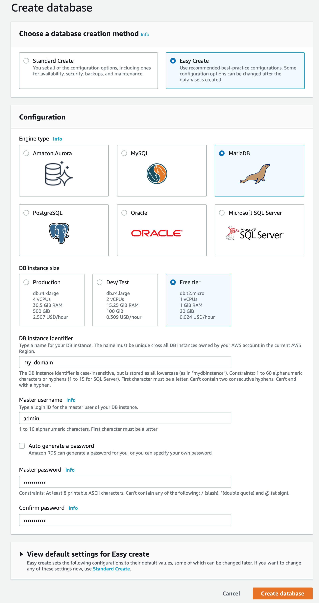
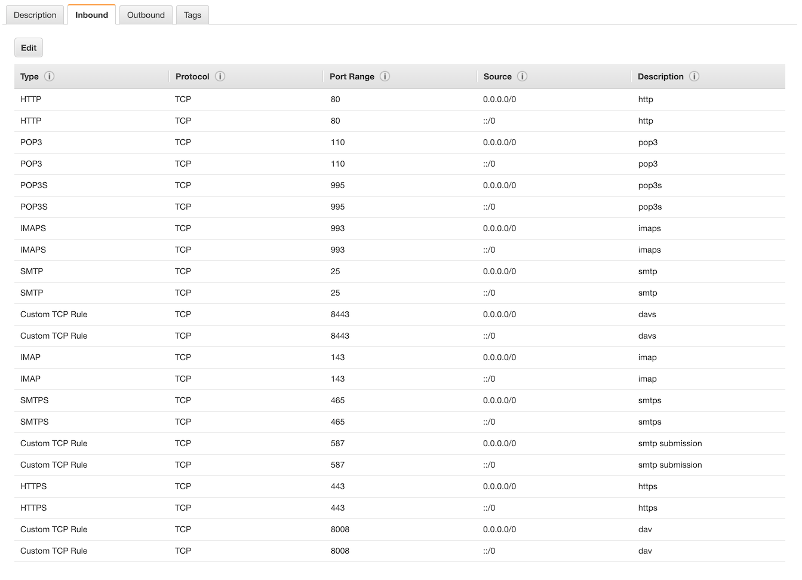
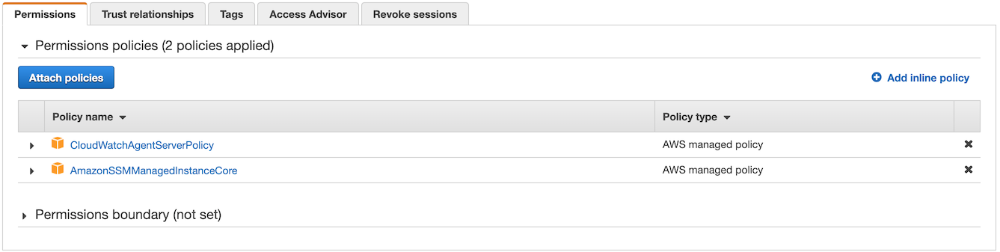

# atmail 8.6.0 on AWS
Installation procedure to install atmail 8.6.0 using AWS EC2, RDS, CloudWatch*, ElasticCache*.
Atmail is a mailserver, webmail suite that rule and control a large set of open sources technologies to run a state-of-the-art mailserver installation. 
The configuration aims to handle multiple domains with indipendent SSL certifciates for SMTP, IMAP, HTTPS.

#### Open Source packages out of the box with AtMail installation:
- _exim_: mail transfer agent (mta) handling smtp protocol for sending/receiving email messages.
- _dovecot_: imap/pop3 server to access email messages on mailserver (include Pigeonhole/Sieve filter/rules language)
- _clamav_: antivirus
- _spam assassin_: e-mail spam filtering
- _php-fpm, nginx_: application server and https server for web-admin and web-mail interface
- _sabredav_: dav(file storage), caldav (calendar), carddav(contacts) server
- _redis_: nosql based for user session management (to be replaced by AWS ElasticCache)
- _ansible_: configuration management and package depolyment tool
- _logstash_: logs processing and transformation (not installed, replaced by CloudWatch Agent)
- _elastic search_: search and analytics engine for events reporting and statistics (not installed, replaced by CloudWatch Insights)
- _mariadb_: open source fork of MySQL relational databases (not installed, replaced by AWS RDS)

#### Open Source add-on packages
- _fail2ban, firewalld_: intrusion prevention software framework that protects computer servers from brute-force attacks
- _impasync_: IMAP transfers tool

#### AtMail proprietary packages
- _atmail api server_: rest api to integrate
- _webmail app_
- _mailserver web admin interface_

### Requirements and documentation notation
- AWS account: you can setup a new account to take advantage of free tiers for many services
- *AtMailID, License*: 1 License from AtMail MailServer + AtMail Suite: minimum purchase for 357users + essential help costs 1450$ (4$ per user per year, 0.33$ per user per month)
- *my_server*: 1 domain to identify mailserver (mail.example.com, mx.example.com) : you can purchase on AWS Route 53.
- *my_password*: 1 strong password that we will use for all packages and installation
- :large_orange_diamond: this symbol remarks patches to fix/improve compatibility of current AtMail installer or installation procedure

## 1. Launch RDS Instance

Launch RDS with MariaDB engine 


If you want to access to the RDS Instance directly from your computer, be sure to configure
*Public Available: True* and restart. 

After RDS is launched please take notes of the IP address. This procedure will refer to RDS IP address as *my_rds*. 

:dollar: RDS separate daatabase allows to use a free tier resources and optimize the mail server workload, with also automatic backup, software update, monitoring and if necessary to increase the performance scaling up the RDs instance. 

## 2. Launch EC2 and security group

Launch EC2 Instance Amazon Linux 2 AMI (HVM), SSD Volume Type - 64-bit (x86). This kind of instance is the most optiimized, efficient, supported type of instance in the AWS universe and it's very easy to adap the AtMail install to work on Amazon Linux 2. 

We reccomend to select *t3.medium* instance to comply with the AtMail minimum requirement of 4GB of memory avialable. It's importante that the RDS and the EC2 instances are in the same region/zone.

:dollar: t3.medium EC2 as reserved instance (no-upfront) as a cost of 25$ per month (300$ per year, 0.85% per year per user on the 357 users license).

It's preferred to have 1 root volume with the operating system and the software (8GB-16GB), and 1 extra EBS volume to hold the imap data.

:pushpin: Evaluate to have 1 encrypted EBS for each domain configured in the mail server: dovecot/Mail_location. 

- Edit the _default_ security group to allow all traffic open only for administration IP (your IP) and assign to RDS and EC2 instances.
- Create a new _atmail_ security group and assign to EC2 and open the following port: smtp(25), smtp submission(587), smtps(465), imap(143), imaps(993), pop3(110), pop3s(995), http(80), https(443), dav(8008), davs(8443)



Be sure to save the Key server pem certificate: *key_server.pem*

## 3. Associate Elastic IP, request Reverse PTR

Alocate a new Elastic IP address and associate with EC2 Instance. Verify that the IP is a 'clean' IP, and it's not already in a blacklist.

Check: https://mxtoolbox.com/blacklists.aspx

If the IP is in a blacklist, release the IP and request a new one. 

:rescue_worker_helmet: Reallocating a new IP is a fast recover procedure if accidentally the mailserver is caught in a blacklist.

It's important to configure the reverse DNS as identity proof for the mail server, and it's necessary to request to AWS. Usually AWS processes the request in a few hours: https://aws.amazon.com/forms/ec2-email-limit-rdns-request

Take note of the IP address: *my_ip*

## 4. CloudWatch and SSM Manager role

 Create a new role _my_role_, attach policies to send logs and metrics to CloudWatch, and enable AWS SSM. Assign the role _my_role_ to RDS and EC2 instance.
 
 

## 5. Enable passwordless root access

Using root access to the server allow a more easy installation procedure (no sudo, or special permission around) and in my opinion a more easy maintenance. It's required a private/public key on the admin computer *id_rsa.pub*: google how to create ssh keys on your os.

```
ssh -i "/volume/.. ../key_server.pem" ec2-user@my_ip
sudo nano /root/.ssh/authorized_keys
```
paste inside the authorized_keys file the content of the id_rsa.pub file.

```
sudo nano /etc/ssh/sshd_config
```
Uncomment and change the following lines to grant root access via ssh and have a stable ssl connection:

```
    PermitRootLogin yes
    ClientAliveInterval 60
    TCPKeepAlive yes
    ClientAliveCountMax 10000
```
```
sudo systemctl reload sshd
```
Test the connection from your computer: 

```
ssh -l root my_ip
```

## 6. Set hostname and install required packages and remove unwanted packages

```
hostnamectl set-hostname my_ip

systemctl stop postfix
systemctl disable postfix
yum remove postfix -y

amazon-linux-extras install epel
yum update -y
yum install nano wget deltarpm ntp dpkg gcc
```

## 7. Install AtMail Mailserver

```
mkdir /_install
cd /_install
wget https://atmail.com/portal2/app/download/product/msvr -O /_install/atmail-mailserver-rpm.tar.gz
tar xvzf atmail-mailserver-rpm.tar.gz
wget https://atmail.com/portal2/app/download/product/app -O atmail-suite-rpm.tar.gz
tar xvzf atmail-suite-rpm.tar.gz
cd /_install/atmail-mailserver-8.6.0/
yum install atmail-common-1.0.0-1.el7.centos.x86_64.rpm -y 
yum install dovecot-2.2.19-1.atmail.el7.centos.x86_64.rpm -y 
yum install dovecot-pigeonhole-2.2.19-1.atmail.el7.centos.x86_64.rpm -y 
yum install dovecot-mysql-2.2.19-1.atmail.el7.centos.x86_64.rpm -y 
yum install atmail-mailserver-ansible-8.6.0-19.el7.centos.x86_64.rpm -y 
yum install atmail-mailserver-8.6.0-19.el7.centos.x86_64.rpm -y 
yum update -y
/usr/bin/atmail-mailserver-install
```
Press enter for most of the requested paramaters, excpet the following:
```
Enter DB host [ localhost ] : my_rds
Enter DB Username with GRANT/CREATE ACCESS [ root ] : admin
Enter DB Username Password [  ] : my_password
```

```
yum install atmail-mailserver-plugin-WebmailIntegration-8.6.0-15.el7.centos.x86_64.rpm -y 
systemctl restart dovecot php-fpm nginx
systemctl status dovecot php-fpm nginx
```
:large_orange_diamond:  AtMail documentation instructs to assign date.timezone = Australia/Brisbane in /etx/php.ini file. I guess that it should be the local timezone of the server. My mailserver serves international domains with users across multiple timezone, and I choose to don't assign any date.timezone, and relay on server timezone that is UTC.

## 8. Configure AtMail Mailserver
:large_orange_diamond: AtMail installation required Centos7 (that is based on RHEL Linux, as well as Amazon Linux2). With a few tweaks, it's possibile to adjust the installation procedure by Atmail to work on Amazon Linux2.

```
ln /etc/system-release /etc/redhat-release
cp -p /var/lib/atmail/mailserver/roles/clamav/vars/RedHat_7.yml  /var/lib/atmail/mailserver/roles/clamav/vars/RedHat.yml
cp -p /var/lib/atmail/mailserver/roles/ss1ip/templates/clamav/freshclam.sysconfig-RedHat_7.j2 /var/lib/atmail/mailserver/roles/ss1ip/templates/clamav/freshclam.sysconfig-RedHat.j2
```
To execute the installation, it's necessary to connect to admin web server.
:large_orange_diamond: Moderm browser don't allow anymore to connec to self-signed certificate HTTPS web sites. For me, it was necessary to launch Google Chrome browser on MacOS with a flag to ignore the certificates. 

```
/Applications/Google\ Chrome.app/Contents/MacOS/Google\ Chrome --ignore-certificate-errors &> /dev/null &
```
Connect to https://*my_server*/admin, User and password: admin. Change password to strong password: *my_password*.

To complete the installation, go to Services tab and press Publish Config button.

## 9. Install AtMail Suite: api server, web mail, dav server

```
cd /_install/atmail-suite-8.6.0/
yum install atmail-common-1.0.0-1.el7.centos.x86_64.rpm  -y 
yum install atmail-api-8.6.0-26.el7.centos.x86_64.rpm -y 
/usr/bin/atmail-api-install
source /etc/profile.d/atmail-apiadmin.sh
apiadmin user add admin my_password  --role=admin
systemctl restart apiserver
systemctl status apiserver
```
:large_orange_diamond: when stopped, atmail-api server returns the following errors, that should be reported, investigated:
```
apiserver.service: main process exited, code=exited, status=2/INVALIDARGUMENT
Unit apiserver.service entered failed state.
apiserver.service failed.
```

cd /_install/atmail-suite-8.6.0/
yum install atmail-webmail-8.6.0-21.el7.centos.x86_64.rpm -y -q
/usr/bin/atmail-webmail-configure
yum install atmail-dav-8.6.0-15.el7.centos.x86_64.rpm -y -q
/usr/bin/atmail-dav-install

:large_orange_diamond: in my first installation, the Publish Config stopped to work because of missconfiguration of linux user *atmail*. I reccomed to check time to time the home directory for the atmail user:
```
cat /etc/password
...
atmail:x:1001:992::/var/lib/atmail/mailserver:/bin/bash
...
```
If it shows a different value from /var/lib/atmail/mailserver, please re-assign using
```
usermod -d /var/lib/atmail/mailserver atmail
```

## 10. Let's Encrypt free SSL certificates for dovecot, exim, nginx
For each mail domain that the mailserver will handle, we need to identify a mailserver name (mail.domain1.com, mail.domain2.com, etc..).
For each mail server we need to configure the following records in the DNS server (Route53)

```
mx.domain.com.					            A		_my_ip_
domain.com.						              MX1		0	mx.domain.com
domain.com.						              TXT		v=spf1 mx -all
_dmarc.domain.com.				         TXT		v=DMARC1; p=quarantine; rua=mailto:postmaster@domain.com; ruf=mailto:postmaster@domain.com; rf=afrf; pct=100
_autodiscover._tcp.domain.com.	SRV		0 5 443 mx.domain.com
_caldavs._tcp.domain.com.		    SRV		0 1 8443 mx.domain.com
_caldavs._tcp.domain.com.		    TXT		"path=/addressbooks"
_carddavs._tcp.domain.com.		   SRV		0 1 8443 mx.domain.com
_carddavs._tcp.domain.com.		   TXT		"path=/calendars"
_imap._tcp.domain.com.			      SRV		0 1 143 mx.domain.com
_imaps._tcp.domain.com.			     SRV		0 1 993 mx.domain.com
_pop3._tcp.domain.com.			      SRV		0 1 110 mx.domain.com
_submission._tcp.domain.com.	 SRV		0 1 587 mx.domain.com
_pop3s._tcp.domain.com.			    SRV		0 1 995 mx.domain.com
```
Install let's encrypt certbot and generate certificate for all the mailserver names.
```
yum-config-manager --enable rhui-eu-central-1-rhel-server-extras rhui-eu-central-1-rhel-server-optional
yum install certbot python2-certbot-nginx
certbot ----standalone --certonly
```
To allow access to the certificates, add accessing users to _atmail_ group and grant access to the certificates folder

```
usermod -a -G atmail dovecot
usermod -a -G atmail exim
usermod -a -G atmail nginx
chown -R atmail:atmail /etc/letsencrypt/archive
chown -R atmail:atmail /etc/letsencrypt/live
chmod -R ug+rw,o= /etc/letsencrypt/archive
chmod -R ug+rw,o= /etc/letsencrypt/live

```

## 11. Configure SSL certificates for nginx
Re-arrange the nginx conf files to have a flexible structure ready to work with multiple domains:
```
rm /etc/nginx/conf.d/atmail-dav.conf
rm /etc/nginx/conf.d/atmail.conf
```
Copy in the directory /etc/nginx/conf.d/ the following 'generic' files that will work with all the :
- https://github.com/webappvicio/atmail860onAWS/blob/master/atmail.include
- https://github.com/webappvicio/atmail860onAWS/blob/master/atmail-dav.include

Duplicate the following file for each mail server, replace name of your mail server (mx.domain.com and reverted com.domain.mx), rename the file, and copy to /etc/nginx/conf.d/:
- https://github.com/webappvicio/atmail860onAWS/blob/master/com.domain.mx.conf

Verifi configuration and restart:
```
nginx -t
systemctl restart nginx
```
Test if you have SSL active for each domain, connecting with your browser to each mail server URL:
https://mx.domain.com
https://mx.domain2.com
https://mx.domain2.com

## 12. Configure primary domain for SSL POP3/IMAP (exim)
:large_orange_diamond: it seems that reference to RDS mariadbis lost in the configuration script. I fix the issue 
```
nano /var/lib/atmail/mailserver/group_vars/all/install
```
Edit as following, replace my_rds with RDS instance URL: 
```
dovecot_db_host: my_rds
exim_db_host:  my_rds
```
Connect to https://my_server/admin, tab=Services, left menu=SMTP:

Check the SSL POP3/IMAP checkbox 
SSL certificate path 	= /etc/letsencrypt/live/my_server/fullchain.pem
SSL key path			       = /etc/letsencrypt/live/my_server/privkey.pem

Press "Publish Config"

:pushpin: This step shold be merged with the step "Multiple Certificates for SSL POP3/IMAP (exim)"

## 13. Configure primary domain for DKIM Signature (exim)
```
chown -R root:exim /etc/exim/dkim
chmod -R u=rw,g=r,o=r /etc/exim/dkim
nano  /var/lib/atmail/mailserver/roles/ss1ip/templates/exim/exim.conf.j2
```
Replace: 
```
DKIM_FILE = {{ exim_dkim_key_dir }}/{DKIM_DOMAIN}.dkim
```
with
```
DKIM_FILE = {{ exim_dkim_key_dir }}/${lc:${domain:$h_from:}}.dkim
```
Connect to https://my_server/admin, tab=Services, left menu=SMTP:

Activate DKIM from the admin interface
Generate DKIM

Update Route53 Records with DKIM signature

## 14. Some Patches to procedure
:pushpin: I'm not sure the following issue could be repeated or just a consequence of some attempts I did during the installation procedure.
- check the on the RDS mariadb instance users: exim.% and dovecot.% can access to database.* at least with SELECT permission
- check ownership/permission of /var/lib/atmail/dovecot/sieve directory to be root/atmail rwxrw-r--. Fix with:
```
chmod -R u=rwx,g=rw,o=r /var/lib/atmail/dovecot/sieve
chgrp -R atmail /var/lib/atmail/dovecot/sieve
```
## 15. Multiple domains with matching SSL certificates for IMAP SSL (dovecot)
```
nano /var/lib/atmail/mailserver/roles/ss1ip/templates/dovecot/dovecot.conf.j2
```
For each mailserver domain add a section: 
```
...
local_name mx.domain.com {
  ssl_cert = </etc/letsencrypt/live/mx.domain.com/fullchain.pem
  ssl_key = </etc/letsencrypt/live/mx.domain.com/privkey.pem
}
local_name mx.domain2.com {
  ssl_cert = </etc/letsencrypt/live/mx.domain2.com/fullchain.pem
  ssl_key = </etc/letsencrypt/live/mx.domain2.com/privkey.pem
}
...
```
Connect to: https://my_server/admin. Press "Publish Config".
Test
```
cat /etc/dovecot/dovecot.conf| grep ssl
openssl s_client -starttls imap -crlf -connect 127.0.0.1:143 -servername mx.domain.com -tlsextdebug
openssl s_client -starttls imap -crlf -connect 127.0.0.1:143 -servername mx2.domain.com -tlsextdebug
openssl s_client -starttls imap -crlf -connect 127.0.0.1:143 -tlsextdebug
```

## 16. Multiple domains with matching SSL certificates for SMTP SSL (exim)
Change the current values in the database: mailserver, table: Inventory
configSection = exim, configVariable = ssl_base_dir: change from /etc/pki/exim > /etc/letsencrypt/live
configSection = exim, configVariable = sni_enable: change from 0 > 1
```
nano  /var/lib/atmail/mailserver/roles/ss1ip/templates/exim/exim.conf.j2
```
Change from:
```
tls_privatekey = ${if exists{{{ exim_sni_key_dir }}/${tls_sni}.key}{{{ exim_sni_key_dir }}/${tls_sni}/privkey.pem}{{{ exim_ssl_key_dir }}/{{ exim_tls_privatekey }}}}
tls_certificate = ${if exists{{{ exim_sni_cert_dir }}/${tls_sni}.crt}{{{ exim_sni_cert_dir }}/${tls_sni}fullchain.pem}{{{ exim_ssl_cert_dir }}/{{ exim_tls_certificate }}}}
```
to
```
tls_privatekey = ${if exists{{{ exim_ssl_base_dir }}/${tls_sni}/privkey1.pem}{{{ exim_ssl_base_dir }}/${tls_sni}/privkey1.pem}{{{ exim_tls_privatekey }}}}
tls_certificate = ${if exists{{{ exim_ssl_base_dir }}/${tls_sni}/fullchain1.pem}{{{ exim_ssl_base_dir }}/${tls_sni}/fullchain1.pem}{{{ exim_tls_certificate }}}}

```
Connect to: https://my_server/admin. Press "Publish Config".
Test
```
cat /etc/exim/exim.conf|grep tls
cat /etc/exim/exim.conf|grep port
...
openssl s_client -starttls smtp -crlf -connect 127.0.0.1:587 -servername mx.domain.com -tlsextdebug
openssl s_client -starttls smtp -crlf -connect 127.0.0.1:587 -servername mx.domain2.com -tlsextdebug
openssl s_client -starttls smtp -crlf -connect 127.0.0.1:587 -tlsextdebug

```
## :pencil2: 17. Install Fail2Ban and firewalld
```
yum install fail2ban
systemctl start fail2ban
systemctl enable fail2ban
systemctl start fail2ban
systemctl enable firewalld
firewall-cmd --zone=public --add-service=smtp --add-service=smtps --add-service=imap --add-service=imaps --add-service=pop3 --add-service=pop3s --add-service=http --add-service=https --add-service=dhcp --permanent
firewall-cmd --zone=public --add-port=587/tcp --add-port=8443/tcp --add-port=8008/tcp  --permanent
firewall-cmd --reload
```

```
nano /etc/firewall/firewall.conf
```
Check and, if necessary, change:
```
LogDenied=off
```

Test status of fail2ban-exim
```
fail2ban-client status exim
```


## :pencil2: 18. Re-arranging name and location of log files (still work in progress)
The configuration we are trying to achieve is to store all the logs file inside the directory /var/log with the name _package_.log for the ordinary log files, _package_.err with error, critical log files.
```
nano /etc/rsyslog.conf
```
Comment (with leading #) all the lines in the "RULE SECTION" of the file /etc/rsyslog.conf
Copy the file
https://github.com/webappvicio/atmail860onAWS/blob/master/99-atmailserver.conf
to /etc/rsyslog.d/
```
systemctl restart rsyslog
```
## :pencil2: 19. Log rotate for all log file (still work in progress)

Copy the file
https://github.com/webappvicio/atmail860onAWS/blob/master/atmailserver.logrotate
to /etc/logrotate.d/

## :pencil2: 18. Configure CloudWatch Agent to send metrics and logs from the server to CloudWatch
```
wget https://s3.amazonaws.com/amazoncloudwatch-agent/linux/amd64/latest/AmazonCloudWatchAgent.zip
unzip AmazonCloudWatchAgent.zip -d amazon-cloudwatch-agent
cd amazon-cloudwatch-agent/
./install.sh
/opt/aws/amazon-cloudwatch-agent/bin/amazon-cloudwatch-agent-ctl -a fetch-config -m ec2 -c ssm:AmazonCloudWatch-linux -s

cp /etc/amazon/ssm/seelog.xml.template /etc/amazon/ssm/seelog.xml
nano /etc/amazon/ssm/seelog.xml
```

```
<seelog type="adaptive" mininterval="2000000" maxinterval="100000000" critmsgcount="500" minlevel="info">
    <exceptions>
        <exception filepattern="test*" minlevel="error"/>
    </exceptions>
    <outputs formatid="fmtinfo">
        <rollingfile type="size" filename="/var/log/amazon-ssm-agent.log" maxsize="30000000" maxrolls="5"/>
        <filter levels="error,critical" formatid="fmterror">
            <rollingfile type="size" filename="/var/log/amazon-ssm-errors.log" maxsize="10000000" maxrolls="5"/>
        </filter>
    </outputs>
    <formats>
	<format id="fmterror" format="%Date %Time %LEVEL [%FuncShort @ %File.%Line] %Msg%n"/>
        <format id="fmtdebug" format="%Date %Time %LEVEL [%FuncShort @ %File.%Line] %Msg%n"/>
        <format id="fmtinfo" format="%Date %Time %LEVEL %Msg%n"/>
    </formats>
</seelog>
```


## 20. Install imapsync on EC2
```
yum install perl-Class-Load perl-IO-Compress perl-Crypt-OpenSSL-RSA perl-Data-Dumper perl-Dist-CheckConflicts perl-ExtUtils-Embed perl-File-Copy-Recursive perl-File-Tail perl-IO-Socket-INET6 perl-IO-Socket-SSL perl-JSON perl-HTML-Parser perl-libwww-perl perl-Mail-IMAPClient perl-Module-Implementation perl-Module-Runtime perl-Module-ScanDeps perl-Net-SSLeay perl-Package-Stash perl-Package-Stash-XS perl-Parse-RecDescent perl-Readonly perl-Regexp-Common perl-Sys-MemInfo perl-TermReadKey perl-Test-Fatal perl-Test-MockObject perl-Test-Simple perl-Test-Pod perl-Test-Requires perl-Try-Tiny perl-Unicode-String perl-URI cpanminus
cpanm Authen::NTLM Data::Uniqid IO::Tee JSON::WebToken JSON::WebToken::Crypt::RSA Test::Mock::Guard
cd /_install
wget -N https://imapsync.lamiral.info/imapsync
chmod +x imapsync
./imapsync
```

## A. Usefulel command

Control Atmail packages:
```
systemctl status dovecot nginx exim php-fpm nginx apiserver spamassassin clamd@scan fail2ban firewalld
systemctl restart dovecot nginx exim php-fpm nginx apiserver spamassassin clamd@scan fail2ban firewalld
systemctl stop    dovecot nginx exim php-fpm nginx apiserver spamassassin clamd@scan fail2ban firewalld
systemctl start   dovecot nginx exim php-fpm nginx apiserver spamassassin clamd@scan fail2ban firewalld
systemctl is-active dovecot nginx exim php-fpm nginx apiserver spamassassin clamd@scan fail2ban firewalld
```
Control AWS packages:
```
systemctl status amazon-cloudwatch-agent.service  amazon-ssm-agent.service
systemctl start amazon-cloudwatch-agent.service  amazon-ssm-agent.service
systemctl restart amazon-cloudwatch-agent.service  amazon-ssm-agent.service
systemctl stop amazon-cloudwatch-agent.service  amazon-ssm-agent.service
systemctl is-active amazon-cloudwatch-agent.service  amazon-ssm-agent.service
```
Ansible Publish Config 
```
sudo -u atmail ansible-playbook /var/lib/atmail/mailserver/mailserver.yml --vault-password-file /etc/atmail/mailserver/.vault -vvvv
```


